# MyAgents

My Agents 混合 Workflows 与 Agent 自主规划/拆解/观察/执行/反思的智能体框架

## 📖  My Agents 简介

还没时间写，以后再说

## 📑 更新日志

**[2025.06.26]** 完成基本测试，添加测试案例日志，增强日志记录功能，修复任务状态处理逻辑，优化工作流执行和计划流程，增加任务并行策略定义

**[2025.06.25]** 修改部分状态处理逻辑，增强代码稳定性，修复部分bug，增加一些接口定义

**[2025.06.15]** 增加训练数据采样脚本，允许并发workflow等注入全局计步器实现并发采样支持

**[很久很久以前]** 完成了核心组件的开发，但是现有模型需要超长提示词才能达到可用的效果，得看看怎么降低推理成本

## 📅 开发计划

### ✅ 已完成

- 开发
- [x] 框架核心组件
  - [x] 问答场景下的核心组件
    - [x] LLM/Agent/Task/Workflow/Environment
- [x] 计步器（防止赛博切糕惨案）
  - [x] 增加对token计步器的支持（计数器不会预估接下来的一步需要多少token，只要当前没超下一步就可以继续执行）
  - [x] 增加多个计步器同时计步，当任一个计步器达到步数上限都进入计步器错误处理（目前只会抛出一个计数器的错误信息）

- 测试
  - [x] 基本流程测试

- 训练
- [x] 数据采样
  - [x] 正样本采样脚本
  - [x] 使用长提示词采样正样本数据，使用短提示词采样负样本数据

### 🔧 开发进行中

- 训练
- [ ] 优化任务拆解规划模型性能
  - [ ] 规划模型SFT/DPO/KTO结果对比

- 开发
- [ ] 日志系统修改
  - [ ] 日志分级，去除冗余日志
- [ ] MCP 服务代理
- [ ] 人类与 Agent 交互式意图识别与任务确定
  - [ ] 增加Agent2Agent支持，并以此作为multi-agents的交互基础

- 测试
- [ ] ⭐⭐⭐ 基础网络检索问答测试
- [ ] 增加提示词自动优化智能体，面向不同任务进行不同不同的提示词改写
  - [ ] 对比先[环境信息->动作提示词]与[动作提示词->环境信息]的效果差别

### 🕥 TODO

- 🛠️ 框架改进
- [ ] 串行与并行任务处理能力
- [ ] 主动插入 **Human in the loop** 点
- [ ] 在制定计划之前再添加一层，这层用于和用户（需求者）进行多次对齐以确定详细需求
  - [ ] 用户要求强制校验
- [ ] 每一层父任务都让模型生成一个回答的模板，然后所有子任务的结果都用于填充模板中的占位符
- [ ] 增加有向无环图任务管理支持

- 🪛 功能增加
- [ ] FastAPI提供服务

- 💪 训练
- [ ] 构建狼人杀游戏环境，并进行强化学习
  - [ ] 在达成任务的前提下，将计步器中剩余的token作为虚拟奖励给模型，但如果任务失败，则会被惩罚

## 🧠 设计思想

- 关于 `Workflow` 和 `Environment`
  - 在程序设计中，函数无状态，类有状态；在 **My Agents** 里，`Workflow` 是无状态函数，`Environment` 是有状态的类
  - 还有一种叫做结构体的东西，光有状态没有任何方法，在 **My Agents** 里，`Task` 即是有状态但无方法的
  - 任何有状态的对象都可以被观察，观察的结果取决于你怎么观察它

- 关于 `Agent`
  - 若人脱离环境存在，则人无法获得任何信息，**My Agents** 里 `Agent` 的信息来源和动作对象都必须是 `Environment`
  - 在 `Agent` 使用的工具中，工具本身也可以带有状态
  - 做 **填空题** 或 **选择题** 会比做主观题更容易一些，所以 **My Agents** 后续会让 `Task` 更偏向于 **选择题** 和 **填空题**

- 关于 ***工作流*** 和 ***自主智能***
  - 人的自由总是有限的，做事情大概也得讲究方法论，所以 **My Agent** 将做事情的流程分为两大核心流程，即任务编排/执行
  - 自由体现在 `Agent` 可以根据任务自主决定如何 **拆解** / **规划** / **执行** 任务，并自主 **检查** 是否达成目标
  - 专业的人做专业的事

- 关于 ***Multi-Agents*** 的实现
  - `Agent` 可以通过本地函数调用的方式调用其他 `Agent`，也可以通过 **RPC** 的方式实现，除此之外，`Agent` 还可以决定是否调用其他 `Agent`，也可以由 `Workflow` 要求 `Agent` 在什么时候必须调用哪个 `Agent`
  - 很多时候，我们只是关心任务是否能完成，而不关心任务具体是由谁执行，这时候 `Agent` 会调用其他 `Workflow` 而不是 `Agent`

- 关于 ***“甩手掌柜”***
  - 我不认为一句话就可以让 `Agent` 达到你想要的目，即使是人，在团队合作或者复杂任务执行过程中，都免不了多次和任务需求方或者其他方面进行对齐
  - 在数学角度上考虑，约束越少，则解空间越大，则结果越不稳定，增加约束，多次修正，这样才能达到想要的效果

- 关于 ***Prompt Engineering*** 和 ***Post Train***
  - 通过 **Prompt Engineering** 有几率可以榨干模型的最强性能，但结果总是不太稳定或者高资源需求的
  - 我希望通过 **『Prompt Engineering』** ➕ **『Post Train』** 实现模型从 *『有提示可以稳定执行』* ➡️ *『不需要提示也知道怎么做』*

## 🚀 执行流程



## 💻 测试案例

```bash
uv run test.py
```

测试日志：[点这里看看](./logs/0e873f03_20250625_190915.log)

## 🔍 开发者文档

[DEV.mc](./myagents/DEV.md)
